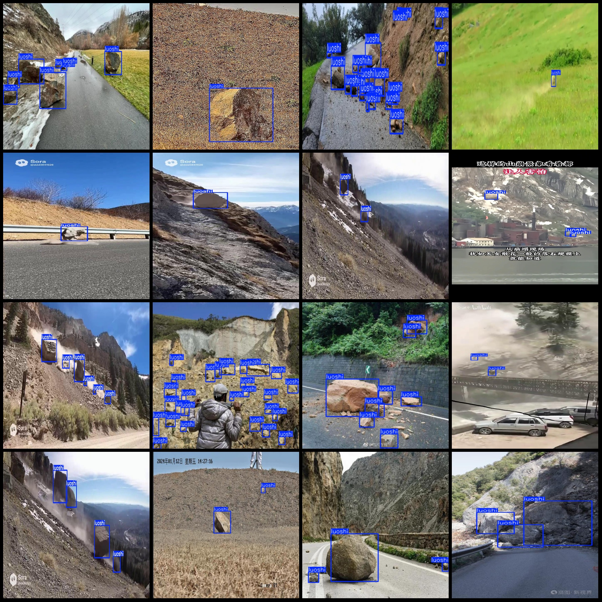
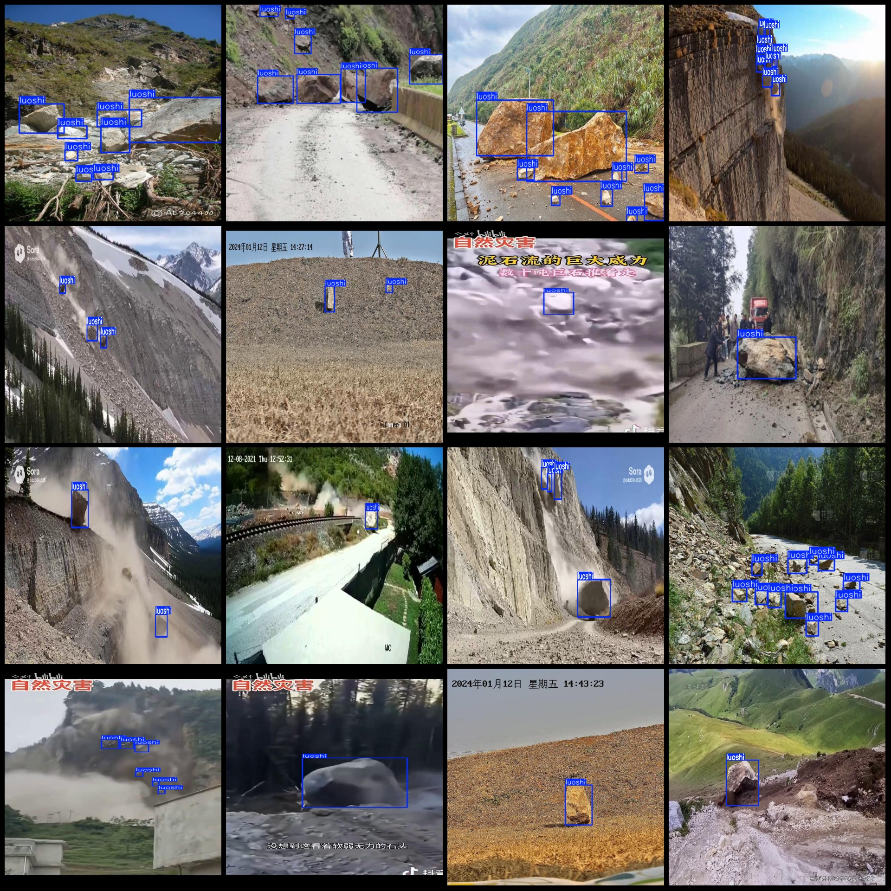

# Mountain Landslide and Hillside Landslide Detection Dataset in VOC+YOLO Format with 1 Category

Dataset format: Pascal VOC format+YOLO format(without split path's txtfile, only containing jpgimage and corresponding VOC format xmlfile and yolo format txtfile)
number of images: 1535  
annotation count: 1535  
annotation count: 1535  
annotationnumber of classes: 1  
annotation class names:["luoshi"]  
boxes per class:   
luoshi box count = 8468  
total boxes: 8468  
images per class:   
luoshi images = 1535  
Image resolution: Multiple resolution images, such as 640x640, 1440x1080, etc.
Use annotation tool: labelImg
Annotation rules: Draw a rectangle around the class for annotation
Important notes: The dataset does not have separate training, validation, and test sets; you need to manually split them.
Special statement: This dataset does not guarantee any accuracy in the trained models or weights file.
Image preview:
## Images

Here is a pay link on Stripe ( https://buy.stripe.com/3cs8yP7sY87d0vu9AB ). Please contact me lonlonago@foxmail.com after funding $89, and I will send you a complete data files , thank you!

